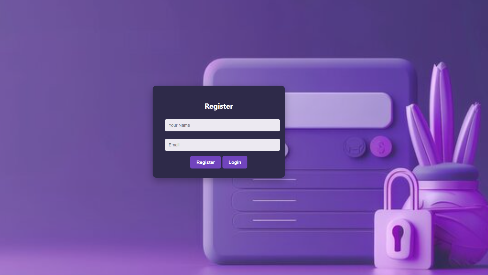
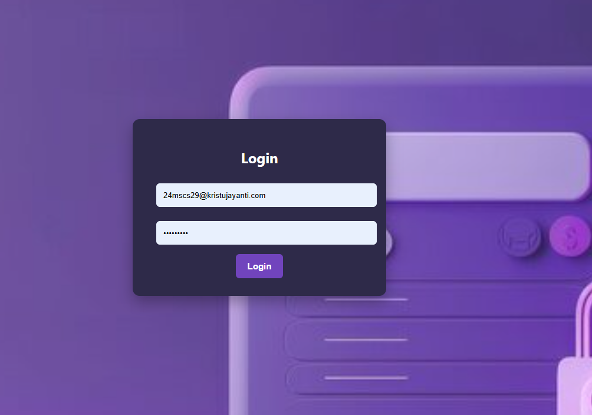
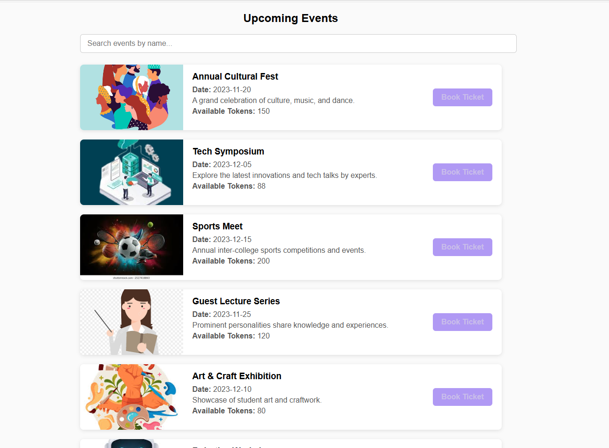
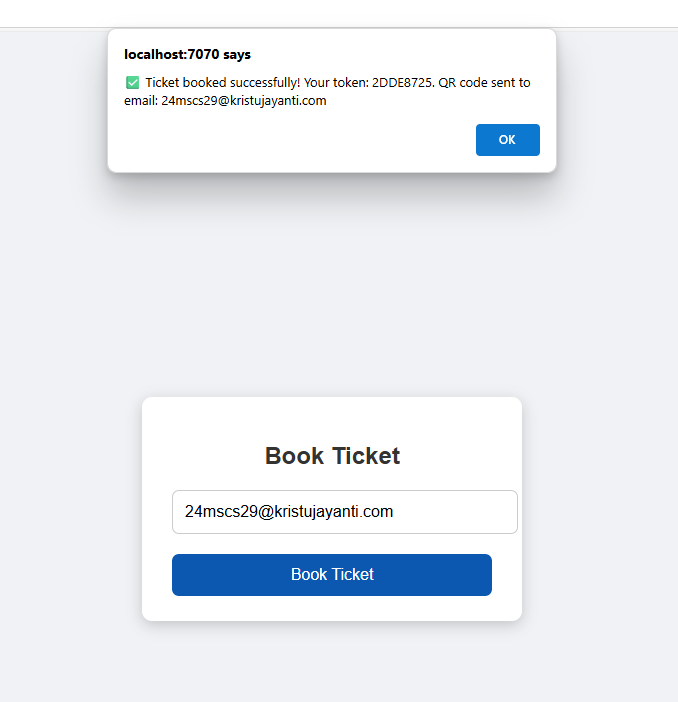
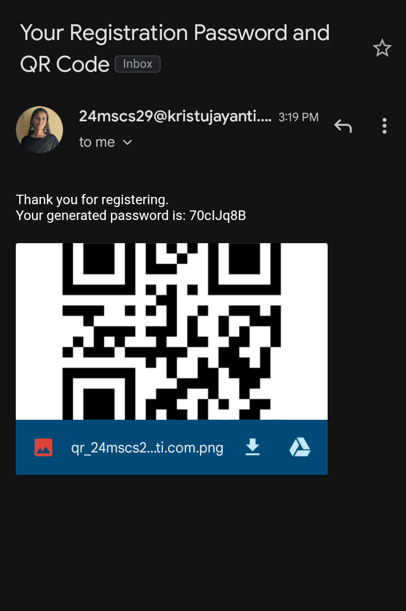
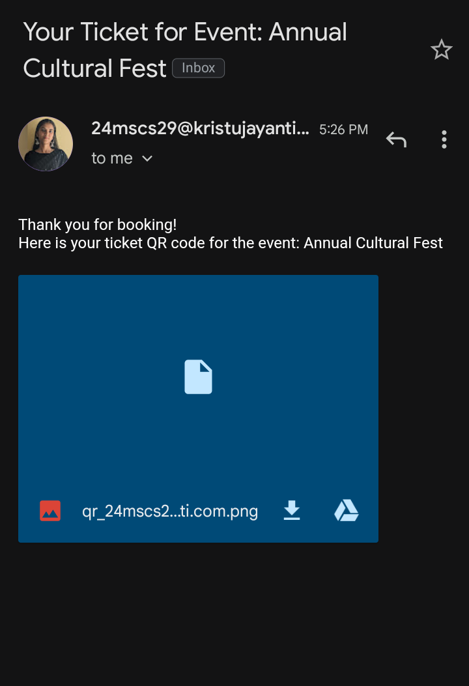

'''java
### Event Ticket Booking System

A simple Java-based web application using Javalin framework and MongoDB for backend, allowing users to register, login, view events
and book tickets with QR code generation and email notifications.

## Features

- User Registration with **random password generation**
- Password sent to user email via **SMTP**
- User Login with email and password
- Event listing fetched from backend
- Ticket booking with **QR code generation**
- QR code sent as email attachment to the user
- MongoDB used to store user data
- Simple UI with HTML forms and JavaScript fetch API

## Technologies Used

- Java 17+
- Javalin web framework
- MongoDB (local or Atlas)
- JavaMail API for email
- ZXing library for QR code generation
- Maven for dependency management














---

## How to Run

1. **Clone the repository** and open in IntelliJ IDEA or any Java IDE.

2. **Setup MongoDB**

   - Ensure MongoDB is running locally (`mongodb://localhost:27017`)
   - Database name used: `eventDB`
   - Collection: `users`

3. **Configure Email Settings**

   - In `EmailService.java`, update your email and app password:
   
     ```java
     final String from = "your.email@gmail.com";          // Your Gmail
     final String appPassword = "your-16-char-app-password"; // Gmail app password
     ```
   
   - For Gmail, generate an **App Password** from Google Account Security settings (recommended).

4. **Build and Run**

   - Build the project with Maven or IntelliJ build tools.
   - Run the `App.java` main class.
   - Server starts on: `http://localhost:7070`

5. **Use the Application**

   - Visit `http://localhost:7070/register.html` to register a new user.
   - Registration automatically generates a random password and emails it.
   - Login using your email and the generated password at `http://localhost:7070/login.html`.
   - View available events on the `events.html` page.
   - Book tickets and receive QR code via email.

---

## Detailed Explanation

### 1. User Registration

- User submits **name** and **email** via `register.html`.
- Backend generates a **random 8-character password** using `SecureRandom`.
- Password and user info are saved in MongoDB.
- Password is emailed to the user via `EmailService` using SMTP.
- After registration, user is redirected to login page.

### 2. Email Sending (`EmailService.java`)

- Uses JavaMail API with SMTP configuration.
- Connects to Gmail SMTP (`smtp.gmail.com`) with TLS on port 587.
- Uses **your Gmail email** and **App Password** for authentication.
- Sends plain text email with generated password.
- Also supports sending email with QR code image attachment (used during booking).

### 3. QR Code Generation (`QRCodeService.java`)

- Uses ZXing library to generate QR codes.
- Generates a PNG image of size 300x300 px encoding text (e.g., booking token).
- Saves QR code image locally with filename pattern `qr_<email>.png`.
- QR code image is attached and sent in booking confirmation email.

### 4. MongoDB Connection (`DBConnection.java`)

```java
private static final MongoClient mongoClient = MongoClients.create("mongodb://localhost:27017");
private static final MongoDatabase database = mongoClient.getDatabase("eventDB");

public static MongoDatabase getDatabase() {
    return database;
}


**Sample Code Snippets**
Password Generation

private static final String CHARACTERS = "ABCDEFGHIJKLMNOPQRSTUVWXYZabcdefghijklmnopqrstuvwxyz0123456789";
private static final SecureRandom random = new SecureRandom();

private static String generateRandomPassword(int length) {
    StringBuilder sb = new StringBuilder(length);
    for (int i = 0; i < length; i++) {
        sb.append(CHARACTERS.charAt(random.nextInt(CHARACTERS.length())));
    }
    return sb.toString();
}


Sending Email with Password
public static void sendEmail(String to, String password) {
    final String from = "your.email@gmail.com";
    final String appPassword = "your-app-password";

    Properties props = new Properties();
    props.put("mail.smtp.host", "smtp.gmail.com");
    props.put("mail.smtp.auth", "true");
    props.put("mail.smtp.port", "587");
    props.put("mail.smtp.starttls.enable", "true");

    Session session = Session.getInstance(props, new Authenticator() {
        protected PasswordAuthentication getPasswordAuthentication() {
            return new PasswordAuthentication(from, appPassword);
        }
    });

    try {
        Message msg = new MimeMessage(session);
        msg.setFrom(new InternetAddress(from));
        msg.setRecipient(Message.RecipientType.TO, new InternetAddress(to));
        msg.setSubject("Your Registration Password");
        msg.setText("Thank you for registering. Your generated password is:\n\n" + password);
        Transport.send(msg);
    } catch (Exception e) {
        e.printStackTrace();
    }
}


Generating QR Code
public static String generateQRCode(String text, String email) {
    try {
        QRCodeWriter writer = new QRCodeWriter();
        var bitMatrix = writer.encode(text, BarcodeFormat.QR_CODE, 300, 300);
        String filePath = "qr_" + email.replace("@", "_") + ".png";
        Path path = Paths.get(filePath);
        try (FileOutputStream fos = new FileOutputStream(filePath)) {
            MatrixToImageWriter.writeToStream(bitMatrix, "PNG", fos);
        }
        return filePath;
    } catch (Exception e) {
        e.printStackTrace();
        return null;
    }
}


Notes
- Make sure MongoDB is running and accessible before starting the server.
- Replace the email credentials with your own for email functionality.
- For production, consider environment variables or config files to secure sensitive data.
- Static HTML files are served from resources/public/ folder.

---

